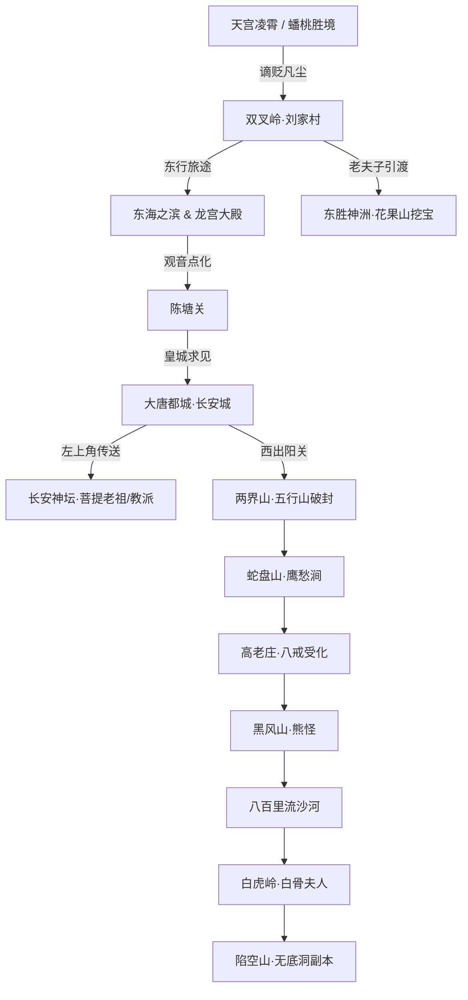

# 汉风西游OL｜场景地图与生态规格 (Scenes & Maps)

> **版本**：v2.0 (官方百科标准权威典藏版)  
> **状态**：正式规范文档 (Active Specification)  
> **数据源**：汉风西游官方百科 / 手游之家FAQ权威归档

---

## 1. 世界地图全域架构

汉风西游OL的世界由“天界仙境”、“大唐盛世”、“东胜胜境”、“西行险关”四大宏观区域组成。标准场景均基于 **38×28** 瓦片规格构建，具备精密的动态生态、NPC功能枢纽与野怪分布体系。

---

## 2. 核心主城与枢纽场景详述

### 2.1 大唐都城·长安城 (`changan_city` 38×28)
全服最核心的贸易、社交、修炼与行政中心。城内各大功能 NPC 严密排布，构成完整的经济与社交生态：

| 建筑/区域 | 驻留 NPC | 核心功能与官方玩法交互 | 涉及规则/消耗 |
| :--- | :--- | :--- | :--- |
| **城西北仙门** | **神坛传送阵** (左上角) | 踏入即可传送至核心场景【神坛】，直达菩提老祖道场。 | 免费双向通行 |
| **长安市场** | **铁匠** | ① **打造装备**：打造头盔、武器、衣服、项链、护腕、鞋子 6 部位装备； ② **装备洗孔**：剥离已镶嵌宝石，洗掉宝石的同时抗性消除； ③ **宝石镶嵌**：将 1~10 级宝石镶入装备孔槽。 | 消耗对应品质矿石与银两；洗孔需消耗一定银两 |
| **长安市场** | **当铺老板** | **全服寄售行系统**： ① 充值满 10000 金砖以上玩家可寄售贵重物品/高级宝石； ② 全体玩家购买当铺出售物品零门槛无限制。 | 寄售扣除手续费，买家直接用银两/金砖结算 |
| **长安医馆** | **老医师** | **全系列药品专卖**： ① 固定数值恢复药（小还丹、活血散等）； ② 百分比气血/法力上限恢复药（九转还魂丹等）； ③ 双回圣药。 | 铜钱/银两购买 |
| **大唐皇家寺院** | **方丈** | **每日体力值发放**： 每天在线累计满半小时以上，可找方丈领取一份和自己等级相同数量的体力值奖励。 | 每日 1 次，打怪享多倍经验与超高掉宝率 |
| **修真街市** | **童子** | **宝物修炼道场**： ① **修炼灵珠**：使用天地灵气注入灵珠，直接提升技能熟练度； ② **修炼金丹**：炼制仙宠金丹，助仙宠快速升级。 | 消耗修行值与银两 |
| **客栈近邻** | **云游商人** | **奇珍异宝与信物商人**： ① 售卖 **胭脂**（赠送女性角色提升好友度）； ② 售卖 **玉佩**（赠送男性角色提升好友度）； ③ 售卖 **祭坛**（结拜与建派必备信物）。 | 银两/金砖直购 |
| **皇城官驿** | **跑环使者** | **30 级跑环连环任务**： 为 30 级及以上侠士发布随机悬赏（寻物、除怪、探访），连环环数越高，高级宝石与金丹奖励越丰厚。 | 角色等级 $\ge 30$ |
| **繁华乐坊** | **长安娱乐场** | **十阶博戏竞技场**： 单周博戏赢金晋升荣誉榜：赌徒、赌鬼、赌豪、赌痴、赌怪、赌狂、赌魔、赌侠、赌圣、赌神。 | 赢取全服至高尊号与全区广播 |
| **官道中央** | **唐太宗** & **御弟玄奘** | 西行主线推进、赐紫金钵盂与通关文牒。 | 主线剧情交互 |

---

### 2.2 长安城·神坛 (`changan_shendan` 38×28 仙家道场)
位于长安城左上角传送阵所达之处，是全服所有修真者突破技能、仙宠转职、宗派林立与义结金兰的圣地：
- **菩提老祖 (宗师道场)**：
  - **新技能传授**：角色或仙宠达到 10 级后，在此学习新技能；
  - **仙宠转职与外观蜕变**：散仙与金仙 10 级时在菩提老祖处学习技能，该技能将直接决定仙宠终身职业（例如白骨精学如来神掌即转职为金刚，外形同步蜕变）；
  - **技能突破升阶**：熟练度达到各阶锁级门槛（Lv.1 5000 锁级，或 1000 提前升阶门槛），必须在此消耗铜钱/银两进行突破升级。
- **教派守护 (总坛执事)**：
  - **教派创建**：15 级以上角色，携带云游商人处购买的【祭坛】，并持有 50 万银两，在此创立教派；
  - **加入教派与教派大战**：处理全服玩家入派申请，每周组织教派淘汰赛与决赛。
- **结拜祭坛**：
  - 双方好友度达到 1000 点（通过使用胭脂/玉佩赠礼达成），携带云游商人处购买的【祭坛】，在此举行誓约仪式，结为异姓金兰，解锁同心协力加成。

---

## 3. 凡间原野与各大历练场景

### 3.1 双叉岭·刘家村 (`liujiacun` 38×28 新手圣地)
- **地形风貌**：翠竹青溪、猎户草堂、宁静祥和的凡间新手村。
- **关键 NPC**：
  - **刘伯钦太保**：出猎重伤初愈的主角之救命恩人；主线接引人，发布采集 2 朵野生青蘑菇与伐木打猎任务；
  - **老夫子 (私塾)**：
    - **师徒系统**：发布招徒贴与拜师贴（10 级以上可收徒，最多 5 个；徒弟享 5% 经验加成，师傅享经验/银两分红）；
    - **花果山挖宝传送**：引渡玩家前往花果山寻宝秘境。
- **生态野怪**：硕鼠 (Lv.1~3)、野兔 (Lv.2~4)、青毒蛇 (Lv.4~6)、狂野猪 (Lv.6~8)。
- **采集资源**：野生青蘑菇（严格采集 2 朵消隐后不再复刷，永续存档）、百年枯木柴。

### 3.2 东胜神洲·花果山 & 水帘洞 (`huaguoshan` / `huaguoshan_shuilien`)
- **场景特性**：十洲之祖脉，三岛之来龙。
- **核心玩法·挖宝秘境**：
  - 由刘家村老夫子传送进入；
  - 在花果山秘境中使用铁锹寻宝，随机产出 **1~3 级宝石**（低级宝石主要产出来源）；
  - 高级宝石需前往更深层矿区开采宝石原矿、精矿、珍矿。
- **驻留单位**：灵猴守卫、通背猿猴、齐天大圣石刻。

### 3.3 东海之滨 & 东海龙宫 (`donghai_coast` / `longgong_palace`)
- **场景特性**：波涛汹涌的海滨与水晶琉璃铺就的龙宫宝殿。
- **核心剧情与战斗**：
  - 滩头击退巡海夜叉与虾兵蟹将；
  - 入水晶宫拜见东海龙王敖广，完成“龙宫借宝”主线，获得全套新手 1 阶蓝装。

---

## 4. 西行八十一难沿途关隘与经典副本

### 4.1 五行山 / 两界山 (`wuxingshan`)
- **场景风貌**：巍峨崇山，佛光禁制萦绕。
- **核心交互**：山脚下被压五百年的齐天大圣孙悟空；峰顶六字大明咒“唵嘛呢叭咪吽”金色神符；玩家受观音旨意揭去神符，轰裂神山释大圣出山。

### 4.2 蛇盘山·鹰愁涧 (`yingchoujian`)
- **生态与剧情**：深涧寒潭，白龙潜水吞噬凡马；大圣与玩家联手战小白龙，菩提老祖与观音显圣点化西海龙太子化为白龙马。

### 4.3 高老庄 (`gaolaozhuang`)
- **生态与收服**：庄院田舍；解救高翠兰，后山云栈洞遇战 **金仙·猪八戒**；玩家使用【收仙金壶】正式点化八戒归队。

### 4.4 八百里流沙河 (`liushahe`)
- **生态与收服**：鹅毛飘不起，芦花定沉底；激战九项骷髅怪 **金仙·沙和尚**；使用【收仙金壶】收服沙僧，渡过流沙天险。

### 4.5 白虎岭 (`baihuling`)
- **生态与收服**：白骨皑皑之险地；迎战千面幻化的 **金仙·白骨精**；成功使用【收仙金壶】收服后，可带往长安神坛找菩提老祖学习如来神掌转职为金刚。

### 4.6 陷空山·无底洞 (`wudidong` 官方高阶团队副本)
- **第一阶段 (抢夺红桃)**：副本成员分工抢摘场景中的红色仙桃，触发暗黑守关灵兽；
- **第二阶段 (Boss 10% 狂暴灭队走位)**：守关 Boss 气血降至 10% 时进入狂暴灭队读条，全员需迅速后撤走位，辅助职业（五庄等）避险后迅速返场复活队友，连续击杀两次破除复活；
- **第三阶段 (百折林刺杀)**：高敏捷角色单人穿梭迷宫至阵眼斩杀核心 Boss 婢女；
- **第四阶段 (牌位决战)**：倾泻火力摧毁地涌夫人供奉牌位，夺取极品 10 阶装备与 5 级高级宝石。

---

## 5. 地图技术规范与瓦片可行走安全准则

1. **统一尺寸**：所有大地图瓦片网格严格统一为 `38×28`；
2. **瓦片可行走性 (Solid Tiles 避坑规范)**：
   - 室内/神坛地面统一使用安全可行走瓦片（如 `heaven_floor`），**严禁将 NPC（尤其是长安神坛的菩提老祖）放置在阻挡瓦片（如 `stone_temple`）上**；
   - 门栏、阶梯、主干道通道宽度必须保持 $\ge 3$ 格，保障多玩家及仙宠同行无阻碍；
3. **安全区保护机制**：主城长安、刘家村草堂、神坛内部属于绝对安全区，禁止强行切磋与野外怪物刷新；
4. **平滑转场**：地图边缘传送点与门道统一配置 0.75s 渐变遮罩，彻底杜绝黑屏与卡顿。

