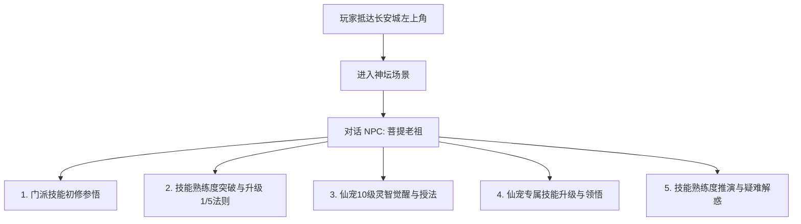

# 汉风西游OL｜全职业技能体系与熟练度核心法则 (Skills & Mastery System)

> **版本**：v2.0 (全量标准策划案)  
> **适用范围**：玩家三大门派全职业技能、仙宠技能体系、神坛宗师交互、战斗数值与熟练度梯度  
> **核心归档路径**：`d:\Extends\Antigravity_proj\maopao\rules\skills.md`

---

## 目录
- [一、技能系统核心哲学与总纲](#一技能系统核心哲学与总纲)
- [二、技能等级与 25000 熟练度法则](#二技能等级与-25000-熟练度法则)
  - [2.1 五级跨度与熟练度封顶](#21-五级跨度与熟练度封顶)
  - [2.2 锁级机制（防死刷保护）](#22-锁级机制防死刷保护)
  - [2.3 1/5 熟练度提前突破升级法则](#23-15-熟练度提前突破升级法则)
- [三、长安城【神坛】场景与【菩提老祖】交互规范](#三长安城神坛场景与菩提老祖交互规范)
  - [3.1 神坛地理位置与进入方式](#31-神坛地理位置与进入方式)
  - [3.2 菩提老祖 NPC 职能全解](#32-菩提老祖-npc-职能全解)
- [四、三大职业技能全图鉴与数值梯级表](#四大职业技能全图鉴与数值梯级表)
  - [4.1 妖魔（法系输出·极道法仙）](#41-妖魔法系输出极道法仙)
  - [4.2 金刚（肉盾/物攻·不动明王）](#42-金刚肉盾物攻不动明王)
  - [4.3 神仙（策略控制·太虚玄灵）](#43-神仙策略控制太虚玄灵)
- [五、核心技能专项数值推演详案](#五核心技能专项数值推演详案)
  - [5.1 【舍生取义】自损换爆发反噬与蓝耗数学模型](#51-舍生取义自损换爆发反噬与蓝耗数学模型)
  - [5.2 妖魔【雷霆万钧】与群体必中法术数值梯度](#52-妖魔雷霆万钧与群体必中法术数值梯度)
  - [5.3 神仙三大控制（乱魂/封印/定身）状态机制与破封规则](#53-神仙三大控制乱魂封印定身状态机制与破封规则)
  - [5.4 佛门玄击双轨法则、【抗玄击】装备绝缘与三大职业天生初始抗性体系](#54-佛门玄击双轨法则抗玄击装备绝缘与三大职业天生初始抗性体系)
- [六、仙宠（宠物）技能独立体系与金仙【元神变身】图鉴](#六仙宠宠物技能独立体系与金仙元神变身图鉴)
  - [6.1 仙宠技能与人物技能绝对隔离原则](#61-仙宠技能与人物技能绝对隔离原则)
  - [6.2 仙宠 10 级神坛启智授法与职业塑型](#62-仙宠-10-级神坛启智授法与职业塑型)
  - [6.3 金仙独门【元神变身】特质与变身时序法则](#63-金仙独门元神变身特质与变身时序法则)
  - [6.4 金仙专属【独门变身天赋】十二神魔全图鉴](#64-金仙专属独门变身天赋十二神魔全图鉴)
- [七、系统接口与技术实现对照指南](#七系统接口与技术实现对照指南)

---

## 一、技能系统核心哲学与总纲

1. **门派三足鼎立**：
   - **妖魔**：极致法术输出。特点是**高威力、高法力消耗、群法必中、强力单体秒杀与多层持续叠毒**。
   - **金刚**：重装前锋与物理爆发。特点是**攻守兼备、高额物理杀伤、打血同时打蓝摧毁敌方续航、舍生自损换取巨额真实杀伤**。
   - **仙人**：战术控制与时局掌控者。特点是**绝对先手压制、多元控制链（乱魂/封印/定身）、战场迷雾（隐身咒干扰敌方判断）**。
2. **技能构成配置（3 技能制）**：
   - 每个门派拥有 3 个技能：**1 个性别专属专属技能 + 2 个全门派通用技能**。
   - 全游戏不存在门派间互相混杂学习的情况，职业特色泾渭分明。
3. **绝对红线原则（零人物治疗法术）**：
   - **全游戏所有门派角色没有任何自身或友方治疗回血技能！**
   - 气血恢复手段有且仅有两种：
     1. 战斗内外使用药品（金创药、大还丹等）；
     2. 携带具有特殊回血特质的金仙仙宠协助恢复。
4. **角色与仙宠技能彻底独立解耦**：
   - 人物角色技能库与仙宠（宠物）技能库严格隔离，命名、熟练度计算与施法逻辑完全独立。

---

## 二、技能等级与 25000 熟练度法则

### 2.1 五级跨度与熟练度封顶
- **初始熟练度**：玩家或仙宠习得任何技能时，初始熟练度均为 `0`。
- **等级划分**：所有技能固定划分为 **5 个品级**（Lv.1 ~ Lv.5）。
- **熟练度跨度**：**每一级熟练度跨度固定为 5000 点**，满级满熟练度为 **25000 点**。

| 技能等级 | 熟练度区间 | 阶段熟练度跨度 | 累计最大熟练度上限 | 状态描述 |
| :--- | :--- | :--- | :--- | :--- |
| **Lv.1** | 0 ~ 5,000 | 5,000 | 5,000 | 初窥门径：技能威力初始阶段，具备基础法效 |
| **Lv.2** | 5,001 ~ 10,000 | 5,000 | 10,000 | 略有小成：技能伤害大幅跃升，群法目标增加 |
| **Lv.3** | 10,001 ~ 15,000 | 5,000 | 15,000 | 融会贯通：控制概率显著增加，威力与蓝耗进入成熟期 |
| **Lv.4** | 15,001 ~ 20,000 | 5,000 | 20,000 | 登峰造极：多目标完全覆盖，控制回合与抗性达到高阶 |
| **Lv.5** | 20,001 ~ 25,000 | 5,000 | **25,000 (极境)** | 天人合一：威力、命中率、目标数封顶，满熟练度神威 |

### 2.2 锁级机制（防死刷保护）
- **锁级规则**：
  - 每一级技能达到当前等级的最高熟练度上限时（例如：Lv.1 达到 5000 点），**系统自动触发锁级保护**。
  - 处于锁级状态下，玩家在战斗中即便再次使用成千上万次该技能，**熟练度也绝对不会再增加 1 点**（保持在 5000 点）。
  - **唯一解锁路径**：玩家必须亲自前往长安城【神坛】寻找【菩提老祖】，完成突破升级仪式，将技能正式提升至下一等级后，熟练度才可继续向下一个 5000 阶段增长。

### 2.3 1/5 熟练度提前突破升级法则
- **提前突破机制（1/5 法则）**：
  - 为了平衡玩家前期冲级进度与深度打磨流派，系统允许玩家在达到**当前等级跨度满熟练度的 1/5 (20%)** 时，即可提前申请向菩提老祖突破升级！
  - **升级门槛对照表**：

| 目标技能等级 | 允许突破的最少熟练度门槛 | 门槛计算逻辑 | 战略选择与差异说明 |
| :--- | :--- | :--- | :--- |
| **升至 Lv.2** | **1,000** 熟练度 | Lv.1 满额 5000 的 1/5 | **速成流**：1000 熟练度即升 Lv.2，立即享受 Lv.2 基础高伤害与多目标，但受反噬或蓝耗增幅也同步提升；<br>**苦修流**：练满 5000 熟练度再升 Lv.2，Lv.1 期间反噬平缓且蓝耗经济，满熟练度底蕴更厚实。 |
| **升至 Lv.3** | **6,000** 熟练度 | 累计达到 Lv.2 基础 5000 + 1000 | 满足 Lv.2 跨度的 1/5 即可提前进阶 Lv.3。 |
| **升至 Lv.4** | **11,000** 熟练度 | 累计达到 Lv.3 基础 10000 + 1000 | 满足 Lv.3 跨度的 1/5 即可提前进阶 Lv.4。 |
| **升至 Lv.5** | **16,000** 熟练度 | 累计达到 Lv.4 基础 15000 + 1000 | 满足 Lv.4 跨度的 1/5 即可提前开启极境 Lv.5。 |

- **熟练度威力正相关铁律**：
  - **不管几级技能，熟练度越高，技能法术效果就越强**！
  - 伤害类：熟练度越高，最终造成的伤害数值越高；
  - 控制类：熟练度越高，初始命中概率越高，控制状态维系回合数越长；
  - 增益类：熟练度越高，提供的物理/法术抗性比例越高，覆盖持续回合越久；
  - 副作用类（如舍生取义）：熟练度越高，威力虽然狂暴提升，但对自身造成的反噬反伤与法力损耗也按比例相应加剧（体现“舍生”的高风险高收益）。

---

## 三、长安城【神坛】场景与【菩提老祖】交互规范

### 3.1 神坛地理位置与进入方式
- **地理方位**：大唐都城·长安城大地图（38×28 规格）**左上角（西北乾位，坐标约 X: 3, Y: 3 附近）**。
- **场景入口**：矗立着泛有五彩霞光的仙道石牌坊与传送阵，踩上后触发转场切图（0.75s 柔和过渡）。
- **神坛环境**：仙云缭绕、万年青松挺拔、八卦道坛悬空，中央端坐世外高人【菩提老祖】。

### 3.2 菩提老祖 NPC 职能全解
菩提老祖为汉风西游世界的**万法之源与武道天尊**，全游戏所有与技能相关的系统全部闭环归集于此：



1. **门派技能初次领悟**：
   - 玩家角色在初入凡尘或达到指定境界时，必须至神坛拜谒菩提老祖，方能开辟法门、激活门派三大专属与通用技能（初始熟练度为 0）。
2. **熟练度突破与等级晋升**：
   - 技能熟练度达到最低门槛（满跨度的 1/5）或练满 5000 触发锁级后，玩家与菩提老祖对话，选择【参悟突破·提升技能品级】。
   - 菩提老祖消耗相应等级的铜钱/师门声望，为玩家灌顶洗髓，技能正式晋升下一级并解锁后续 5000 熟练度增长通道。
   - **无交互即锁死**：若不与老祖对话突破，角色将永远卡在当前等级与熟练度上限。
3. **仙宠 10 级觉醒授业**：
   - 野外捕获或孵化获得的仙宠，在等级达到 **10 级** 时，必须由主人携同前往神坛拜谒菩提老祖。
   - 老祖为灵宠拂拭灵台，正式传授仙宠专属战斗法术（如天雷、烈火、神佑等），开启仙宠技能成长树。

---

## 四、三大职业技能全图鉴与数值梯级表

### 4.1 妖魔（法系输出·极道法仙）
> 妖魔掌握天地至极灵气，法力消耗极高，但威力毁天灭地。群法必定命中，单体落雷毁天灭地，万毒攻心绵延绝杀。

> **【妖魔天生初始抗性】**：
> 游戏经典法则：“我是这个职业的我自然会对本职业的某些技能有抗性”。  
> 妖魔天生自带：**10% 物理抗性**、**10% 雷霆抗性**、**10% 飞沙抗性**、**10% 三昧真火抗性**、**10% 万毒攻心抗性**。

#### 1. 男妖魔专属：【雷霆万钧】（落雷）
- **类型**：单体极高法伤，非必中（受敌方法抗与闪避影响）。
- **定位**：门派绝对点杀单体核弹。
- **法力消耗规律**：天生高蓝耗，Lv.1 即需 300 点法力，随技能等级递增。
- **等级与熟练度梯度表（最新官方基准）**：

| 技能等级 | 熟练度区间 | 单次施法蓝耗 (MP) | 伤害范围 (零熟练度 → 满熟练度) | 战术核心定位与说明 |
| :--- | :--- | :--- | :--- | :--- |
| **Lv.1** | 0 ~ 5,000 | 300 | **420** → **1,200** | 0 熟练度初始伤害 **420**，耗蓝 300 MP；随熟练度提升逐步成长至 1200。 |
| **Lv.2** | 5,001 ~ 10,000 | 450 | **1,500** → **3,200** | 突破至 2 级后威力质变，1000 熟练度提前升级伤害保底 1500，满 10000 熟练度单体轰杀 3200。 |
| **Lv.3** | 10,001 ~ 15,000 | 600 | **3,500** → **5,800** | 中后期核心点杀核弹，单击足以重创同级精英怪与玩家。 |
| **Lv.4** | 15,001 ~ 20,000 | 750 | **6,200** → **9,200** | 极高法力消耗，需搭配大容量回蓝药品（定神香）。 |
| **Lv.5** | 20,001 ~ 25,000 | 900 | **9,600** → **12,608** | **天劫魔雷极境**：Lv.5 满 25000 熟练度精准达到 **12,608** 点九天魔雷伤害！ |

#### 2. 女妖魔专属：【万毒攻心】（毒术）
- **类型**：持续减益（DoT），可叠加层数。
- **定位**：软磨硬泡、持久战破防克肉神技。
- **技能机制**：
  - 给目标施加剧毒状态，首回合爆发毒伤，后续回合毒伤严格按照**上一回合的 75%** 持续衰减递减扣血！
  - 熟练度提升：大幅增加毒术命中概率，并延长持续毒发回合数（2 回合 → 5 回合）。
- **等级与熟练度梯度表**：

| 技能等级 | 施法蓝耗 | 作用目标数 | 首回合基础毒伤 | 衰减规则 | 基础命中率 (熟练度加成) |
| :--- | :--- | :--- | :--- | :--- | :--- |
| **Lv.1** | 260 MP | 1 目标 | 300 ~ 600 | 持续 3 回合，每回合为上回合 75% | 65% ~ 80% |
| **Lv.2** | 380 MP | 2 目标 | 700 ~ 1,200 | 持续 3 回合，每回合为上回合 75% | 70% ~ 85% |
| **Lv.3** | 520 MP | 2 目标 | 1,400 ~ 2,200 | 持续 4 回合，每回合为上回合 75% | 75% ~ 90% |
| **Lv.4** | 680 MP | 3 目标 | 2,400 ~ 3,500 | 持续 4 回合，每回合为上回合 75% | 80% ~ 92% |
| **Lv.5** | 820 MP | 3 目标 | 3,800 ~ 5,000 | 持续 5 回合，每回合为上回合 75% | 85% ~ 96% |

#### 3. 妖魔通用：【三昧真火】（火系群攻）与【飞沙走石】（风系群攻）
- **类型**：群体法术，**绝对必中**（不可闪避）。
- **目标数量法则**：随技能等级提升，作用目标从 1 个逐步增加至最多 4 个（`1 → 2 → 3 → 4`）。
- **蓝耗规律**：群法蓝耗高于常规单体技能，且命中的目标越多，消耗法力越高。
- **等级与熟练度梯度表**：

| 技能等级 | 最大攻击目标数 | 基础施法蓝耗 (随目标递增) | 目标人均伤害 (0熟练度 → 满熟练度) | 特性说明 |
| :--- | :--- | :--- | :--- | :--- |
| **Lv.1** | 1 目标 | 320 MP | **350** → **700** | 初始阶段单体必中群法胚子，耗蓝高，稳如泰山。 |
| **Lv.2** | 2 目标 | 460 MP (单目标) ~ 520 MP (2目标) | **750** → **1,400** | 正式展现群杀锋芒，清怪主力。 |
| **Lv.3** | 3 目标 | 600 MP ~ 700 MP (3目标) | **1,500** → **2,600** | 稳定覆盖 3 目标，多人对战压血线核心。 |
| **Lv.4** | 3 目标 | 750 MP ~ 880 MP (3目标) | **2,800** → **4,200** | 极高法伤，每人均摊依然保持高额杀伤。 |
| **Lv.5** | **4 目标 (封顶)**| 900 MP ~ 1,050 MP (4目标) | **4,500** → **6,000+** | 轰炸全场，大决战必中毁灭风暴。 |

---

### 4.2 金刚（肉盾/物攻·不动明王）
> 金刚拥有崇高的佛门金身与排山倒海的巨力。以强劲体魄为盾，既能削减敌方气血法力破坏节奏，亦能舍身换取毁天灭地的自损爆发。

> **【金刚天生初始抗性】**：
> 游戏经典法则：“我是这个职业的我自然会对本职业的某些技能有抗性”。  
> 金刚天生自带：**20% 物理抗性**、**10% 舍生抗性**、**5% 玄击抗性**。  
> ⚠️ **【抗玄击全服唯一法则】**：在游戏中，针对【佛光普照】与【如来神掌】这两个技能的抗性统一叫做**【抗玄击】**。全游戏中**没有任何宝物、装备或宝石可以增加抗玄击**！金刚职业天生自带的 5% 玄击抗性是全服唯一的抗玄击来源。

#### 1. 男金刚专属：【佛光普照】（极强单体玄击 · 伤害基数+双固定百分比）
- **类型**：单体玄击神技。
- **伤害本质与运算公式（官方权威法则）**：
  - 佛光普照对敌方造成的杀伤不是固定数值，其**核心主打百分比削损，伤害基数仅为起步保底**，严格遵循：  
    $$\text{单次玄击伤害} = \left(\text{伤害基数} + \text{敌方当前生命值} \times \text{固定百分比}\right) \times (1 - \text{抗玄击})$$
    $$\text{单次扣除法力} = \left(\text{敌方当前法力值} \times \text{固定百分比}\right) \times (1 - \text{抗玄击})$$
  - **数值跨度规范（基数主打辅助，百分比主打爆发）**：
    - **Lv.1 初始（0熟练度）**：伤害基数仅为 **150** 点（百分比为主），扣除 **20%** 当前生命与 **10%** 当前法力；
    - **典型中阶节点**：在特定熟练度阶段，佛光普照单次施放打出 **600（伤害基数）+ 30%（敌方当前生命值）+ 扣除 15%（敌方当前法力值）** 的恐怖压制；
    - **Lv.5 满级极境（25000熟练度）**：伤害基数成长至 **1,500** 点，直扣敌方近 **40%** 当前生命与 **20%** 当前法力！
  - **战术地位**：直接重创敌方高血肉盾与高法力法系核心，抽空敌方法力让其无法施展高阶法术，且不可被任何装备抗性抵消。
- **等级与熟练度梯度表**：

| 技能等级 | 施法蓝耗 | 伤害基数 (0熟练度 → 满熟练度) | 目标当前生命削扣比例 | 目标当前法力削扣比例 | 典型效果示例与战术特征 |
| :--- | :--- | :--- | :--- | :--- | :--- |
| **Lv.1** | 120 MP | **150** → **350** | **20%** → **25%** 当前HP | **10%** → **12%** 当前MP | 初期单体玄击，以百分比为主，基数仅 150 起步 |
| **Lv.2** | 180 MP | **350** → **600** | **25%** → **30%** 当前HP | **12%** → **15%** 当前MP | **典型中阶节点**：达到约 **600 + 30% HP + 15% MP** |
| **Lv.3** | 240 MP | **600** → **900** | **28%** → **33%** 当前HP | **14%** → **17%** 当前MP | 敌方血量越高削损越狂暴，无视装备防御 |
| **Lv.4** | 300 MP | **900** → **1,200**| **31%** → **36%** 当前HP | **16%** → **19%** 当前MP | 深度断蓝，逼迫敌方法系完全无法施展群法 |
| **Lv.5** | 360 MP | **1,200**→ **1,500**| **34%** → **40%** 当前HP | **18%** → **22%** 当前MP | **大乘佛光极境**：基数达 **1500**，蒸发近半血量与两成以上法力 |

#### 2. 女金刚专属：【如来神掌】（群体玄击 · 覆盖多目标 · 威力均衡）
- **类型**：群体玄击神技。
- **与佛光普照对比法则（官方权威法则）**：
  - 如来神掌同样遵循 **【伤害基数 + 敌方当前生命值固定百分比 + 扣除敌方当前法力值固定百分比】** 的玄击规则；
  - **单体威力与基数低于佛光普照的原因**：  
    **如来神掌随着等级提升可以变成攻击多个目标（群体 1~4 人）**。为了保持职业单体与群体的数值平衡，并且因为玄击主打百分比伤害，因此如来神掌单体伤害基数与双百分比均低于佛光普照单体：
    - **Lv.1 0熟练度**：伤害基数仅为 **100** 点（对单目标）；
    - **Lv.5 满熟练度**：伤害基数达到 **1,000 / 每位**（全队 4 人总计 4000 基数，且全体各受百分比斩杀！）；
  - **战术定位**：虽然单体威力不如佛光普照，但在多人对战与 Boss 战中，一掌降临同时削弱全队敌人的血线与蓝线，群体压制力极其惊人。
- **等级与目标覆盖梯度表**：

| 技能等级 | 施法蓝耗 | 作用目标数 | 伤害基数 (0熟练度 → 满熟练度) | 目标当前生命削扣比例 | 目标当前法力削扣比例 | 群体特性与战术定位 |
| :--- | :--- | :--- | :--- | :--- | :--- | :--- |
| **Lv.1** | 180 MP | 1 目标 | **100** → **220** | **12%** → **15%** 当前HP | **6%** → **8%** 当前MP | 单体初悟玄击，基数仅 100 起步，效果略低于佛光 |
| **Lv.2** | 260 MP | **2 目标** | **220** → **400** | **14%** → **17%** 当前HP | **7%** → **9%** 当前MP | 正式覆盖双目标，开始显现群体削蓝威力 |
| **Lv.3** | 340 MP | **3 目标** | **400** → **600** | **16%** → **19%** 当前HP | **8%** → **10%** 当前MP | 压制 3 名敌人，使敌方群体节奏瘫痪 |
| **Lv.4** | 420 MP | **3 目标** | **600** → **800** | **18%** → **21%** 当前HP | **9%** → **11%** 当前MP | 高阶群体玄击，削弱敌方全队反击能力 |
| **Lv.5** | 500 MP | **4 目标 (全队)** | **800** → **1,000 / 每位**| **20%** → **24%** 当前HP | **10%** → **13%** 当前MP | **万佛朝宗极境**：轰击全队 4 人，每人基数 1000 + 群体大掉血掉蓝 |

#### 3. 金刚通用：【舍生取义】（核心神技·自损换爆发）
- **类型**：近战物理真实爆发，**完全忽略目标物理防御，以自损自身气血为代价换取绝杀真伤**。
- **核心规律（最新官方基准）**：
  - **1 级 0 熟练度**：伤害 **500** 点，反噬自损 **0** 点，耗蓝 220 点；**10 熟练度以内免伤保护**；
  - **1 级 10 熟练度之后**：伤害提升至 **501** 点，自身反噬 **1 点**，耗蓝 220 点；
  - **1 级 1000 熟练度**：伤害 **650** 点，自身反噬 **40 点**，耗蓝 250 点；
  - **1000 熟练度提前升至 2 级（1/5 法则）**：伤害跃升至 **1,600 点**，自身反噬暴增至 **400 点**，耗蓝 350 点！
  - **5 级满 25000 熟练度**：伤害高达 **约 16,000 点**，单次自伤反噬 **8,000 点气血**！
  - **气血施展铁律**：生命值低于 10% 无法施展；若刚好 10% 或不够单次扣血，自身气血保持在 1 点濒死，下次因低于 10% 无法再次施展（除非回血至 10% 以上）。

#### 4. 金刚通用：【金刚护体】（团队防御 Buff）
- **类型**：团队增益辅助。
- **技能效果**：为自身与友方目标加持佛光金钟罩，**同时提升物理抗性与法术抗性**，有效抵御妖魔轰炸与仙人异常控制。
- **等级与熟练度梯度表**：

| 技能等级 | 施法蓝耗 | 庇护目标数 | 物理/法术双抗加成 (0熟练度 → 满熟练度) | 持续回合 |
| :--- | :--- | :--- | :--- | :--- |
| **Lv.1** | 150 MP | 1 目标 (自身/指定友军) | **+12%** → **+20%** 双抗 | 3 回合 |
| **Lv.2** | 220 MP | 2 目标 | **+22%** → **+30%** 双抗 | 3 回合 |
| **Lv.3** | 300 MP | 3 目标 | **+32%** → **+40%** 双抗 | 4 回合 |
| **Lv.4** | 380 MP | 3 目标 | **+42%** → **+48%** 双抗 | 4 回合 |
| **Lv.5** | 460 MP | **4 目标 (全队)** | **+50%** → **+60%** 双抗 | **5 回合** |

---

### 4.3 神仙（策略控制·太虚玄灵）
> 神仙道法通玄，以无上心印拨弄战场阴阳。神仙虽无直接秒人威能，但一式控神封印即可让敌方战阵瞬间瘫痪。

> **【神仙天生初始抗性】**：
> 游戏经典法则：“我是这个职业的我自然会对本职业的某些技能有抗性”。  
> 神仙天生自带：**10% 物理抗性**、**10% 封印抗性**、**10% 乱魂抗性**、**10% 定身抗性**。

#### 1. 男神仙专属：【乱魂咒】（混乱神术）
- **状态机制**：**混乱状态**。
  - 陷入混乱的目标丧失神智，在其行动回合**只能进行普通攻击**，且攻击目标在场上**所有单位（包括其自身队友、甚至敌我双方随机选择）**中随机抽取！
  - **禁令**：混乱目标**不能释放技能、不能自己主动吃药**。
  - **救援机制**：其未混乱的队友可以使用道具操作，**主动为其喂药（解药或补血）**。
- **等级与熟练度梯度表**：

| 技能等级 | 施法蓝耗 | 最大控制目标数 | 初始命中率 (0熟练度 → 满熟练度) | 混乱持续回合 |
| :--- | :--- | :--- | :--- | :--- |
| **Lv.1** | 200 MP | 1 目标 | **45%** → **65%** | 2 回合 |
| **Lv.2** | 280 MP | 2 目标 | **55%** → **72%** | 2 ~ 3 回合 |
| **Lv.3** | 380 MP | 2 目标 | **62%** → **78%** | 3 回合 |
| **Lv.4** | 480 MP | 3 目标 | **70%** → **82%** | 3 ~ 4 回合 |
| **Lv.5** | 580 MP | **3 目标** | **78%** → **85%** | **4 回合** |

#### 2. 女神仙专属：【封印咒】（全服最强硬控）
- **状态机制**：**完全封印状态**。
  - 最绝对的刚性硬控。被封印目标周身被八卦金锁禁锢，**完全无法行动**！
  - **禁令**：不能普通攻击、不能施法、不能主动吃药、不能召唤宠物。
  - **救援机制**：自身完全停滞，但允许其友方队友使用解控药品（如清心散）为其解除封印。
- **数值成长（最新官方基准）**：
  - **初始（Lv.1 0熟练度）命中率**：**62%**；
  - **满级满熟练度（Lv.5 25000熟练度）命中率**：**95%**；
  - 随熟练度平滑提升，持续 2 ~ 4 回合，受目标【抗封锁】（蓝宝石、珍珠）减免。

#### 3. 神仙通用：【定身咒】（半控制·挨打即破）
- **状态机制**：**定身状态**。
  - 封印目标的四肢与攻杀手段。
  - **限制**：目标**不能进行物理攻击、不能释放任何法术**。
  - **自救宽限**：但目标神念未受损，**可以自己吃药、可以进行仙宠召唤**！
  - **破封机制**：**一旦受到场上任意来源的直接物理或法术伤害，定身状态立刻解除苏醒**！
- **数值成长（最新官方基准）**：
  - **每个目标初始命中率**：**33%**；
  - **满级满熟练度单体命中率**：**75%**；
  - 施法蓝耗较低（140 ~ 380 MP），受目标【抗围困】（绿宝石、琥珀）减免。

#### 4. 神仙通用：【隐身咒】（战场信息迷雾）
- **类型**：战略欺骗增益。
- **技能效果**：为友方目标施加太清道气隐匿。
- **核心机制**：
  - **非完全潜行**（敌方仍可选中攻击），但能够**彻底隐藏被加持角色的血量气血条、蓝条与时序速度条数据**！
  - 敌方无法探知其真实残血状态，亦无法精准预判谁先出手，极大干扰敌方指挥集火决策。
  - 随熟练度提升，持续回合数由 3 回合延长至 6 回合，作用人数由 1 人扩展至全队 4 人。

---

## 五、核心技能专项数值推演详案

### 5.1 【舍生取义】自损换爆发反噬与蓝耗数学模型

根据最新官方基准规范设定：
1. **基础阶段（Lv.1 前期）**：
   - `0` 熟练度：伤害 **`500`**，反噬 `0`，蓝耗 `220`；
   - `1 ~ 10` 熟练度：伤害 `500`，反噬 `0`（免伤新手保护）；
   - `11` 熟练度：伤害 `501`，反噬 `1`，蓝耗 `220`；
   - `1000` 熟练度：伤害 `650`，反噬 `40`，蓝耗 `250`；
2. **提前升级阶段（Lv.1 达到 1000 熟练度即升 Lv.2）**：
   - 晋升 Lv.2 瞬间：伤害跃升至 **`1,600`**，自身反噬提升至 **`400`**，蓝耗提升至 **`350`**！
3. **满阶巅峰阶段（Lv.5 达到 25,000 满熟练度）**：
   - 伤害达到 **约 16,000** 破甲绝杀！使用一次单次自损反噬 **8,000** 点气血！
4. **【核心铁律】气血施法门槛与扣除法则**：
   - **低于 10% 气血严禁施展**：当自身当前气血低于最大生命值的 10%（`hp < maxHp * 0.1`）时，**完全无法施展舍生取义**（系统提示气血枯竭，无力施展）；
   - **扣血致死保护与 1 点残血锁死**：若当前气血刚好为 10% 或者当前气血不足以抵扣单次自损扣血时，**自身气血不会直接致死，而是强制保持在 1 点气血濒死**！
   - **续发禁用**：保持在 1 点血后，因为此时气血必定低于 10% 门槛，**下回合绝对无法再次施展舍生取义**，除非通过自身/队友吃药或仙宠治疗将气血恢复至 10% 以上！

#### 舍生取义五级关键锚点数值推演表：

| 技能等级 | 熟练度节点 | 目标所受伤害 | 自身承受反噬 | 单次施法蓝耗 | 战术特征与实战评析 |
| :--- | :--- | :--- | :--- | :--- | :--- |
| **Lv.1** | 0 熟练度 | **500** | **0** | 220 MP | 新人初学，无反噬，输出平稳 (气血需 $\ge 10\%$) |
| **Lv.1** | 10 熟练度 | **500** | **0** | 220 MP | 临界点，免伤机制最后节点 |
| **Lv.1** | 11 熟练度 | **501** | **1** | 220 MP | 触发反噬，掉 1 滴血，迈入杀伐之道 |
| **Lv.1** | 1,000 熟练度 | **650** | **40** | 250 MP | **突破阈值**：已达 1/5 门槛，可前往神坛升 2 级 |
| **Lv.1** | 5,000 熟练度 (满) | **1,000** | **100** | 300 MP | Lv.1 满额状态，自损可控，触发锁级保护 |
| **Lv.2** | 1,000 熟练度 (提前升) | **1,600** | **400** | 350 MP | **速成升阶**：爆发倍增，自损高达 400，需备好药品 |
| **Lv.2** | 10,000 熟练度 (满)| **3,000** | **1,200** | 420 MP | 2 级巅峰，一击破千甲，自损需队友协同 |
| **Lv.3** | 6,000 熟练度 (提前升) | **3,500** | **1,500** | 450 MP | 迈入金刚巨灵境，打出强力压制 |
| **Lv.3** | 15,000 熟练度 (满)| **6,000** | **3,000** | 540 MP | 高风险高收益，自身自伤 3000 点气血 |
| **Lv.4** | 11,000 熟练度(提前升) | **7,000** | **3,500** | 560 MP | 顶级核弹，残血金刚慎用 |
| **Lv.4** | 20,000 熟练度 (满)| **10,500**| **5,500** | 660 MP | 毁天灭地，自身承受 5500 点反噬 |
| **Lv.5** | 16,000 熟练度(提前升) | **12,000**| **6,000** | 700 MP | 舍身成仁，极限破防 |
| **Lv.5** | **25,000 满熟练度**| **16,000**| **8,000** | **850 MP** | **大乘金刚道**：以 8000 血换 16000 物理真伤绝杀！ |

---

### 5.2 妖魔【雷霆万钧】与群体必中法术数值梯度

- **雷霆万钧 (男妖魔极高单体魔雷)**：
  - **Lv.1 0熟练度**：伤害 **420**，高法力消耗 **300 MP**；
  - **Lv.5 满 25,000 熟练度**：威力高达 **12,608** 点九天魔雷伤害！初期 300 蓝耗极度考验法力续航，后期一击定乾坤。
- **必中法术机制（三昧真火/飞沙走石）**：
  - 彻底屏蔽目标闪避率判定与敏捷规避。
  - 无论目标敏捷多高、无论带何种轻功装备，**必中判定必定穿透**。
  - 命中伤害衰减逻辑：当攻击 1 目标时享受 100% 全额法术系数；攻击 2 目标时各承受 85%；攻击 3 目标时各承受 75%；攻击 4 目标时各承受 65%（总输出远超单体）。

---

### 5.3 仙人三大控制（乱魂/封印/定身）状态机制与破封规则

为保障 PvP 与高难 PvE 战斗深度，仙人的三大控制技能设置有极其严谨的**优先级、状态互斥与解除法则**：

```
                 ┌────────────── 乱魂咒 (混乱) ──────────────┐
                 │ • 随机普攻任意目标 (敌我皆打)            │
                 │ • 禁施法、禁自用药                       │
                 │ • 允许队友喂药拯救                       │
                 └──────────────────────────────────────────┘
                                      ▲
                                      │ (互斥覆盖：硬控优先)
                                      ▼
                 ┌────────────── 封印咒 (硬封) ──────────────┐
                 │ • 完全不能行动、禁一切物理/法术          │
                 │ • 禁自用药、禁召宠                       │
                 │ • 允许队友喂解控药解除                   │
                 └──────────────────────────────────────────┘
                                      ▲
                                      │ (高位压制)
                                      ▼
                 ┌────────────── 定身咒 (半控) ──────────────┐
                 │ • 禁物理攻击、禁法术释放                 │
                 │ • 允许自用药、允许召宠物                 │
                 │ • 【特殊破封】：受到任意直接伤害立即解除 │
                 └──────────────────────────────────────────┘
```

1. **状态互斥原则**：同个单位身上，封印咒优先级高于乱魂咒，乱魂咒优先级高于定身咒。高阶控制命中时直接覆盖低阶控制。
2. **受到伤害破防逻辑**：唯一定身咒具备“受到直接伤害即刻解除”机制，乱魂与封印受到物理/法术攻击不会被打断，只能等待自然回合结束或使用药品解除。
3. **队友喂药操作规范**：战斗指令界面中，健康队友可点击【道具】→【金创药/清心散】→【目标选择受控队友】进行喂药。

---

### 5.4 佛门玄击双轨法则、【抗玄击】装备绝缘与三大职业天生初始抗性体系

#### 1. 玄击双轨百分比伤害模型（佛光普照与如来神掌）
- **核心运算公式**：
  $$\text{HpDamage} = \left(\text{BaseDmg} + \text{Target}.\text{curHp} \times \text{HpRatio}\right) \times (1 - \text{ResXuanji})$$
  $$\text{MpDrain} = \left(\text{Target}.\text{curMp} \times \text{MpRatio}\right) \times (1 - \text{ResXuanji})$$
- **伤害基数设计定位（主打百分比，基数适中）**：
  - 玄击技能主打的是【百分比削损】，因此伤害基数绝不会过高喧宾夺主；
  - **佛光普照（单体玄击）**：Lv.1 0熟练度伤害基数仅为 **150**，满级满熟练度基数达到 **1,500**；
  - **如来神掌（群体玄击）**：Lv.1 0熟练度伤害基数仅为 **100**，满级满熟练度基数达到 **1,000 / 每位**（全队 4 人满额 4000 基数）；
- **深度机制与单体/群体差异**：
  - **佛光普照（单体最强玄击）**：
    - 造成的伤害严格为：**【伤害基数 + 固定百分比（敌方当前生命值）+ 扣除固定百分比（敌方当前法力值）】**；
    - 典型熟练度效果：在特定中阶熟练度节点单次打出 **600 + 30%（敌方当前生命值）+ 15%（敌方当前法力值）**；
    - 单体针对性极强，令高血肉盾与高蓝法师瞬间陷入残血与空蓝窘境。
  - **如来神掌（群体范围玄击）**：
    - 机制与佛光普照相同，但**单体基数与百分比均低于佛光普照**；
    - **原因**：如来神掌升级后可以攻击多目标（群体 1~4 人），为了保障门派平衡，单体数值自然不如单体专注的佛光普照；但在大阵交锋中，全队同时扣血扣蓝的压制力无人能出其右。

#### 2. 【抗玄击】全服唯一法则（装备与宝物绝对绝缘）
- **官方唯一定义**：在游戏中，专门针对【佛光普照】与【如来神掌】这两个技能的防御抗性，全服统称为 **【抗玄击】**；
- **全服零装备抗玄击铁律**：**游戏中没有任何宝物、装备、宝石可以对这两个技能增加抗性**！
  - 无论玩家如何打造极品神装、无论镶嵌 11 大宝石中的何种宝石，都绝对无法获得任何【抗玄击】属性；
  - 常规装备的物理抗性与法术抗性对玄击百分比削扣完全无效，赋予佛门玄击无与伦比的战术穿透力。

#### 3. 三大职业天生自带初始抗性体系 (Innate Class Resistances)
- **核心哲学**：**“对应职业有对应职业初始的抗性”**。  
  正如武道法理所言：**“我是这个职业的我自然会对这个职业的某些技能有抗性”**。修道者自幼参悟本门法诀，天然对本门系的道法与特定杀招具备肉体与元神层面的天生抵御力：

| 职业门派 | 职业天生自带初始抗性一览 | 机制与战术解析 |
| :--- | :--- | :--- |
| **金刚** | **20% 物理抗性** (`res_physical: 0.20`)<br>**10% 舍生抗性** (`res_shesheng: 0.10`)<br>**5% 玄击抗性** (`res_xuanji: 0.05`) | **全服唯一天生抗玄击者**！全服没有任何装备带抗玄击，唯金刚佛门肉身自带 5% 抗玄击；同时天生 20% 物理厚甲减免与 10% 舍生减免，牢不可破。 |
| **妖魔** | **10% 物理抗性** (`res_physical: 0.10`)<br>**10% 雷霆抗性** (`res_leiting: 0.10`)<br>**10% 飞沙抗性** (`res_feisha: 0.10`)<br>**10% 三昧真火抗性** (`res_sanmei: 0.10`)<br>**10% 万毒攻心抗性** (`res_wandu: 0.10`) | 妖体魔骨，天生抵御 10% 普攻物理伤害；对本门雷系（雷霆万钧）、风系（飞沙走石）、火系（三昧真火）、毒系（万毒攻心）四大毁灭技能天生自带 10% 免伤。 |
| **神仙** | **10% 物理抗性** (`res_physical: 0.10`)<br>**10% 封印抗性** (`res_fengyin: 0.10`)<br>**10% 乱魂抗性** (`res_luanhun: 0.10`)<br>**10% 定身抗性** (`res_dingshen: 0.10`) | 仙家灵台清明，天生自带 10% 物理减伤；对三界神识类控制（封印咒、乱魂咒、定身咒）天生具备 10% 抵抗减免几率，不易被轻易打乱节奏。 |

#### 4. 金刚护体双抗叠加规则
- 护体提供的物理抗性与法术抗性，与装备自带抗性采用**乘算递减叠加**，杜绝 100% 绝对免伤漏洞：
  $$FinalRes = 1 - (1 - GearRes) \times (1 - BuffRes)$$

---

## 六、仙宠（宠物）技能独立体系与金仙【元神变身】图鉴

### 6.1 仙宠技能与人物技能绝对隔离原则
1. **技能库彻底物理隔离**：
   - 仙宠技能绝非角色技能，不能由人物角色习得；人物门派技能亦绝不可被仙宠跨界装配。
   - 仙宠拥有独立的法力值、属性成长资质、技能栏位与独立的战斗 AI 释放逻辑。
2. **零人物治疗红线下的仙宠辅助定位**：
   - 人物角色自身没有任何恢复气血的技能。仙宠是战场上除了药品之外唯一的生命维系来源；
   - 稀有金仙仙宠可领悟【甘霖普降】或带有特殊吸血反哺天赋，成为队伍中千金难求的战术核心。

### 6.2 仙宠 10 级神坛启智授法与职业塑型
- 新生或刚收服的野生仙宠，初始仅具备 1 个基础天赋本能；
- 升级至 **Lv.10** 时，主人必须携带仙宠前往长安城西北角【神坛】，由万法之祖【菩提老祖】点化启智：
  - 开启第 2、第 3 技能学习槽；
  - 正式传授仙宠专属战斗技能（如法术主动技【天雷引】、【三味火】、【落石崩】；被动神通【高级必杀】、【高级神佑】、【高级反震】）；
  - **职业重塑**：仙宠在神坛所学习的技能门类将直接重塑其门派职业与战斗神相（如白骨精学习金刚武学将转职为金刚，获得金身法相加成）。

---

### 6.3 金仙独门【元神变身】特质与变身时序法则

**全服唯有【第一梯队·金仙】拥有参悟前世大能真灵、在战斗中激发【元神变身】的至高特权**（散仙与凡宠绝无此能力）：

1. **变身时序与持续周期**：
   - **回合初判定**：在**每个行动回合开始、各单位尚未下达指令前**，系统自动检测参战金仙的当前气血与天赋点，执行变身概率检定；
   - **固定 3 回合形态**：一旦变身判定成功，金仙立绘瞬间蜕变为通体泛着紫金色神光的【真灵法相】，**持续时间严格固定为 3 个回合**；
   - **周期结束恢复**：变身持续满 3 回合后，于回合末解除变身恢复常态，下回合初继续参与新一轮逆境变身判定。
2. **【血量越低，几率越高】逆境觉醒公式**：
   $$P_{\text{transform}} = P_{\text{base}}(\text{TalentPoints}) + 0.1 \times \left(1 - \frac{\text{curHp}}{\text{maxHp}}\right)$$
   - **基础几率**：由仙宠累计的天赋点决定（0 天赋点时为 5%，满 5000 天赋点时为 25%）；
   - **逆境爆发**：生命值亏损越严重，觉醒概率越高！当仙宠濒危（如只剩 10% 气血）时，概率直接额外增加 **9%**！绝境逆风变身往往能扭转乾坤。
3. **天赋点数成长与获取闭环**：
   - **天赋点上限**：**5,000 点**；
   - **自然实战领悟**：金仙在战斗中**每次成功触发变身，永久获得 1 点天赋点**（前期成长慢热，越战越强）；
   - **宝物快速灌注**：使用稀世宝物【**天赋丹**】，**每枚直接为该金仙永久增加 50 点天赋点**；
   - **数值平衡克制**：即便练满 5000 天赋点，各项效果均受到严格边界约束，绝不出现破坏平衡的绝对无敌或无解秒杀。

---

### 6.4 金仙专属【独门变身天赋】十二神魔全图鉴

每位金仙根据其在西游神话中的因果神格，拥有**绝不重复的专属独门变身天赋**：

| 金仙名称 | 专属变身天赋名称 | 触发类型与生效机制 | 0 天赋点初阶效果 | 5000 天赋点满阶极境效果 | 战术定位与克制解析 |
| :--- | :--- | :--- | :--- | :--- | :--- |
| **白骨精** | **【画皮移伤】** | **受击触发**<br>(被动转移) | 变身后受到直接伤害时，**5%** 伤害随机转移给场上一名任意单位(敌我皆有可能) | 变身后受到直接伤害时，**30%** 伤害随机转移给场上一名单位，自身仅承受 70% 伤害 | 替死玄机，残血变身后敌方越集火越可能误伤己方队友或反弹死敌人。 |
| **黄风怪** | **【三昧神风·断速】** | **攻击命中触发**<br>(概率打乱时序) | 变身后普攻或技能命中，**30%** 概率使目标出手速度降至全场最低；群法命中则群体降速 | 变身后命中目标 **70%** 概率使目标速度降为全场最低；群法则全命中目标全部降速！ | **战术控速天花板**！彻底摧毁敌方配速链，让原本先手的封印仙人或敏法妖魔沦为最后出手。 |
| **沙和尚** | **【流沙护体·蓝移】** | **受击触发**<br>(**必中生效**，非概率) | 变身后受到直接伤害时，**15%** 伤害直接由当前法力值(MP)扣除抵消，自身气血免受这部分伤害 | 变身后受到的 **35%** 伤害全部直接由法力值抵扣，只要法力未空，肉度不可动摇！ | **法力替血神坦**！必中稳定减免，配合高蓝量与回蓝药品，成为最坚实的团队肉盾。 |
| **猪八戒** | **【天蓬真元·巨灵】** | **变身瞬间触发**<br>(**必中生效**，持续3回合) | 变身瞬间立即增加气血上限与当前血量：**+500 HP + 15% 最大气血** | 变身瞬间气血暴增：**+2,000 HP + 35% 最大气血**，化身顶天立地的超级巨灵！ | **纯粹肉盾巅峰**！残血触发变身瞬间直接被巨额气血抬回健康线，吸收全队海量火力。 |
| **牛魔王** | **【大力蛮牛·狂暴】** | **变身瞬间+普攻**<br>(**必中生效**，双重增幅) | 变身后生命提升 **+300 HP + 10% 血量**；同时物理攻击力 **+20%** (仅普攻生效) | 变身后生命提升 **+1,200 HP + 25% 血量**；物理攻击力狂暴暴涨 **+50%** (仅普攻生效)！ | 与八戒严格区分！兼备肉度与毁天灭地的纯物理近战点杀爆发，平天大圣的霸道杀伐。 |
| **小白龙** | **【龙魂啸天·疾行】** | **变身常驻+施法**<br>(速度增加+概率连击) | 变身后身法速度直接 **+50 点**；释放法术攻击时 **20%** 概率触发【法术连击】(双重施法) | 变身后速度直接 **+100 点** (绝对抢占全场第一先手)；释放法术攻击 **45%** 概率法术连击！ | 先手雷霆风暴！配合高速度在敌方出手前完成法术双连轰炸，压低全场血线。 |
| **金角大王** | **【紫金吸魂·断蓝】** | **技能攻击命中**<br>(伤害吸蓝) | 变身后施展技能造成伤害时，额外汲取敌方 **10%** 当前法力值回补自身 | 变身后技能命中直接抽取敌方 **25%** 当前法力值回补自身，让敌方空蓝瘫痪！ | 针对高蓝法师的断蓝绝技，破坏妖魔雷霆施法，保障自身持续施法。 |
| **银角大王** | **【移山填海·逆御】** | **变身常驻**<br>(逆境免伤+法暴) | 变身后法术暴击率 **+15%**；自身每损失 10% 生命，额外获得 **2%** 最终免伤(上限10%) | 变身后法术暴击率 **+30%**；自身已损失生命转化为免伤，最高可达 **25%** 绝对免伤！ | 越残血越难被击杀，残血状态下法暴全开，绝地反杀翻盘神将。 |
| **红孩儿** | **【六道真火·嗜血】** | **法术与普攻命中**<br>(持续百分比吸血) | 变身后造成的所有伤害，其 **15%** 转化为自身当前气血回复 | 变身后造成的所有伤害，其 **35%** 转化为自身气血回复！一记烈火直接回满半管血！ | 毁灭性高伤与续航一体，只要能够打出法术伤害即可源源不断自我回血。 |
| **铁扇公主** | **【太阴神风·破障】** | **风系技能命中**<br>(群体增益驱散) | 变身后风系法术命中，**40%** 概率驱散目标身上的所有防御 Buff(如金刚护体等) | 变身后风系技能命中，**80%** 概率彻底吹散目标全队防御加成 Buff，并附带风伤暴击！ | 战术破防核心，专门克制金刚护体与各类双抗 Buff，让敌方防御体系瞬间瓦解。 |
| **黄袍怪** | **【奎木凶星·噬魂】** | **普攻命中+击杀**<br>(普攻吸血+追击) | 变身后普攻附带 **20%** 物理吸血；击杀目标后 **30%** 概率对随机敌人追击一次 | 变身后普攻附带 **40%** 吸血；击杀目标后 **80%** 概率立即发动二次追杀！ | 战阵收割残血之王，连环追击滚雪球压制。 |
| **黑熊精** | **【黑风磐石·化劲】** | **变身常驻+受击**<br>(双抗加持+反震) | 变身后双抗 **+15%**；受到物理近战伤害将 **20%** 伤害反震反弹给攻击者自身 | 变身后双抗 **+30%**；受到物理近战伤害将 **40%** 伤害反震给攻击者自身！ | 物理克星，高反震让高攻物理金刚和妖魔近战不敢轻易对其出手。 |

---

## 七、系统接口与技术实现对照指南

为后续代码（`js/core/skills.js`、`js/data/skillsData.js`、`js/core/battle.js`）落地实现提供清晰定义：

```javascript
// 示例数据契约模型
const SKILL_MASTERY_RULE = {
  maxLevel: 5,
  spanPerLevel: 5000,
  maxMastery: 25000,
  breakthroughRatio: 0.20, // 1/5 法则：满额跨度的 20% (即 1000 熟练度) 即可升阶
  
  // 计算当前能否升级
  canUpgrade(currentLevel, currentMastery) {
    if (currentLevel >= 5) return false;
    const requiredMastery = (currentLevel - 1) * 5000 + 5000 * this.breakthroughRatio;
    return currentMastery >= requiredMastery;
  },
  
  // 计算熟练度上限锁
  isLocked(currentLevel, currentMastery) {
    const levelCap = currentLevel * 5000;
    return currentMastery >= levelCap;
  }
};

// 菩提老祖交互常量定义
const SHENDAN_CONFIG = {
  mapId: 'changan_shendan',
  entranceCoords: { map: 'changan_city', x: 3 * 32, y: 3 * 32 }, // 长安城左上角
  masterNpcId: 'npc_puti_laozu',
  masterNpcName: '菩提老祖'
};
```

---

> **结语**：本策划规格书已将三大门派 3 技能配置、5 级与 25000 熟练度封顶、1/5 提前突破法则、长安神坛菩提老祖神职、舍生自损数学模型及仙宠独立体系严密闭环，后续系统编码及数值配置均以此文档为唯一基准。
